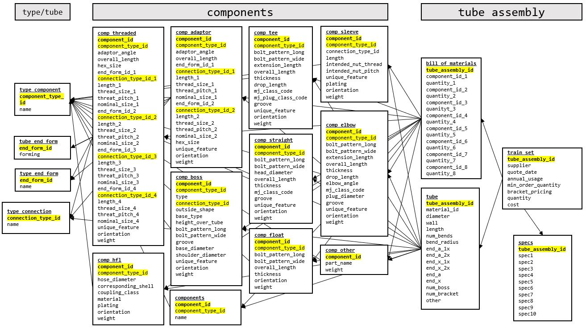

# Predicting-Tube-Assembly-Prices-CW README

## Contents

  + Predicting tube assembly prices using historical data
  
  + Overview
    + This is project code and documentation
    + Useful as a reference for data wranglin and machine learning model training and comparison in Python
  
  + Getting Started
    + Installation & Prerequisites
      + Python Version 3.0
        + https://www.python.org/downloads/windows/
      + Jupyter Notebooks
        + https://www.jupyter.org/
  
  + Included files:
    + *Predicting_Tube_Assembly_Prices.ipynb* : Jupyter notebook for the project
    + *Predicting_Tube_Assemlby.py* : Python code for the project
    + *RMSLE.jpg*: Picture of the RMSLE formula, taken from https://www.kaggle.com/c/caterpillar-tube-pricing#evaluation
    + *Schema.jpg*: Picture of table relationship schema, created in Microsoft Power Point
